# go demo

[](https://circleci.com/gh/saschagrunert/demo)
[](https://codecov.io/gh/saschagrunert/demo)



### A framework for performing command line demos in the wild

Recording command line demos can be a difficult topic these days. Doing a video
record has the drawback of lacking flexibility and reduced interactivity during
the demo. Typing everything by our own is error prone and distracts the audience
from the actual topic we want to show them. So we need something in between,
which is easy to use…

This framework should solve the issue by provided interactive demos from your
command line!

# Usage

Every "demo" is a stand-alone command line application which consists of
multiple "runs". For example, if we create a demo like this:

```go
package main

import (
	demo "github.com/saschagrunert/demo"
)

func main() {
	demo.New().Run()
}
```

Then this demo already contains features like autoplay. We can verify this
checking the help output of the executable:

```
NAME:
   main - A new cli application

USAGE:
   main [global options] command [command options] [arguments...]

VERSION:
   0.0.0

COMMANDS:
   help, h  Shows a list of commands or help for one command

GLOBAL OPTIONS:
   --all, -l                     run all demos (default: false)
   --auto, -a                    run the demo in automatic mode, where every step gets executed automatically (default: false)
   --auto-timeout auto, -t auto  the timeout to be waited when auto is enabled (default: 3s)
   --continuously, -c            run the demos continuously without any end (default: false)
   --immediate, -i               immediately output without the typewriter animation (default: false)
   --skip-steps value, -s value  skip the amount of initial steps within the demo (default: 0)
   --help, -h                    show help (default: false)
   --version, -v                 print the version (default: false)
```

The application is based on the [urfave/cli](https://github.com/urfave/cli)
framework, which means that we have every possibility to change the app before
actually running it.

```go
// Create a new demo CLI application
d := demo.New()

// A demo is an usual urfave/cli application, which means
// that we can set its properties as expected:
d.Name = "A demo of something"
d.Usage = "Learn how this framework is being used"
d.HideVersion = true
```

## Creating runs inside demos

To have something to show, we need to create a run and add it to the demo. This
can be done by using the `demo.Add()` method:

```go
func main() {
	// Create a new demo CLI application
	d := demo.New()

	// Register the demo run
	d.Add(example(), "demo-0", "just an example demo run")

	// Run the application, which registers all signal handlers and waits for
	// the app to exit
	d.Run()
}

// example is the single demo run for this application
func example() *Run {
	// A new run contains a title and an optional description
	r := NewRun(
		"Demo Title",
		"Some additional",
		"multi-line description",
		"is possible as well!",
	)

	// A single step can consist of a description and a command to be executed
	r.Step(S(
		"This is a possible",
		"description of the following command",
		"to be executed",
	), S(
		"echo hello world",
	))

	// Commands do not need to have a description, so we could set it to `nil`
	r.Step(nil, S(
		"echo without description",
		"but this can be executed in",
		"multiple lines as well",
	))

	// It is also not needed at all to provide a command
	r.Step(S(
		"Just a description without a command",
	), nil)

	return r
}
```

The `example()` function creates a new demo run, which itself contains of
multiple steps. These steps are executed in order, can contain a description and
a command to be executed. Wrapping commands in multiple lines will automatically
create a line break in the command line.

## Setup and Cleanup functions

It is also possible to do something before or after each run. For this the setup
and cleanup functions can be set to the demo:

```go
func main() {
	// Create a new demo CLI application
	d := demo.New()

	// Be able to run a Setup/Cleanup function before/after each run
	d.Setup(setup)
	d.Cleanup(cleanup)
}

// setup will run before every demo
func setup(ctx *cli.Context) error {
	// Ensure can be used for easy sequential command execution
	return Ensure(
		"echo 'Doing first setup…'",
		"echo 'Doing second setup…'",
		"echo 'Doing third setup…'",
	)
}

// setup will run after every demo
func cleanup(ctx *cli.Context) error {
	return Ensure("echo 'Doing cleanup…'")
}
```

# Contributing

You want to contribute to this project? Wow, thanks! So please just fork it and
send me a pull request.
